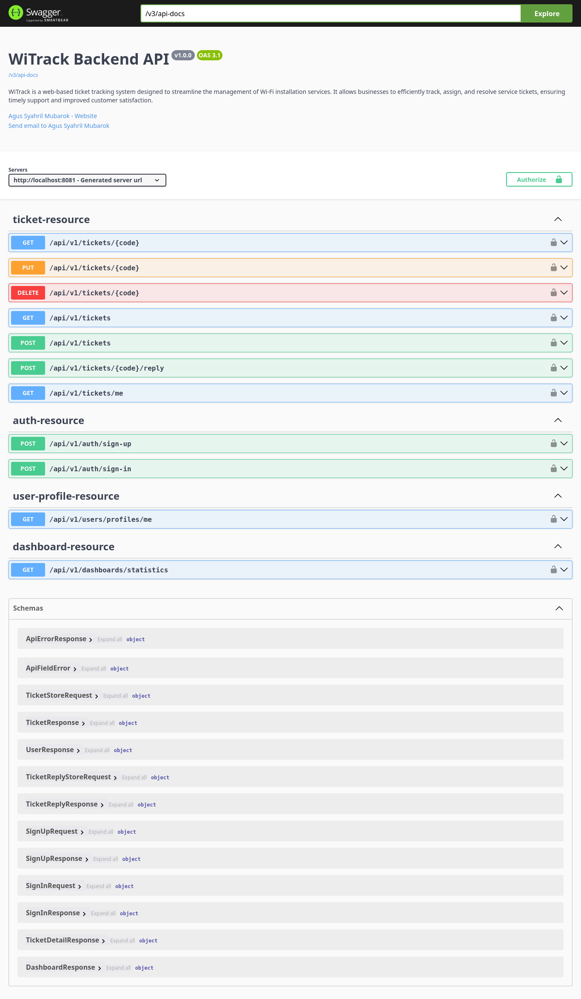
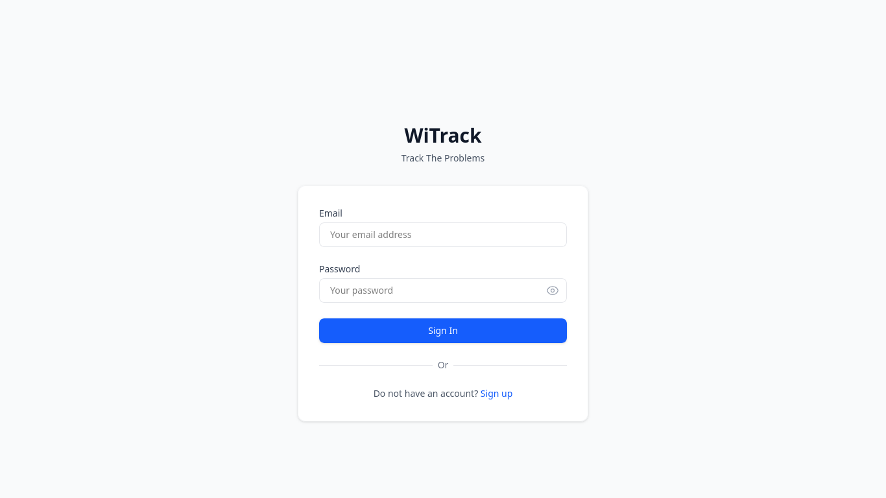
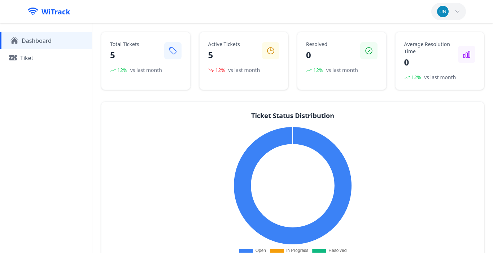
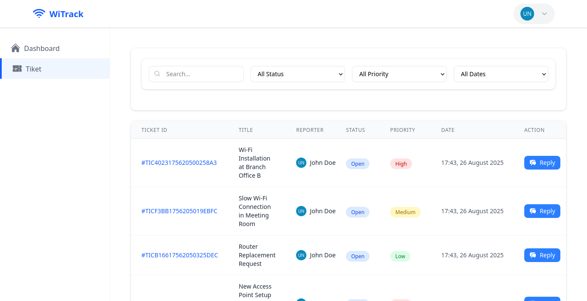
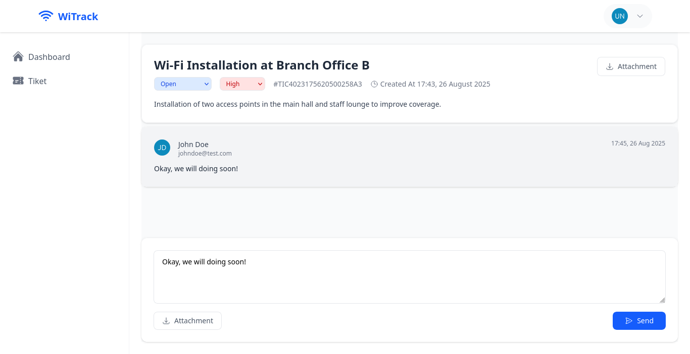

# WiTrack

WiTrack is a web-based ticket tracking system designed to streamline the management of Wi-Fi installation services. It allows businesses to efficiently track, assign, and resolve service tickets, ensuring timely support and improved customer satisfaction. The application features a Java backend for robust, high-performance processing, and a Vue.js frontend for a responsive and intuitive user interface.

## Features

* **Ticket Management**: Create, update, assign, and close Wi-Fi installation tickets.

<details>
  <summary>📸 Screenshots (click to expand)</summary>
  
    
    
    
    
    
    
</details>

## Technology Stack

* [Java](https://www.java.com/)
* [Spring](https://spring.io/)
* [MongoDB](https://www.mongodb.com/)
* [Testcontainers](https://testcontainers.com/)
* [Vue.js](https://vuejs.org/)
* [Tailwind CSS](https://tailwindcss.com/)
* [JWT](https://jwt.io/)

## Explore

```bash
# Run Infrastructure
docker compose -f docker-compose-bakend.yml up -d --build

# Run API
cd backend
mvn clean install verify
mvn clean spring-boot:run
# http://localhost:8081/swagger-ui/index.html

# Run Frontend
cd frontend
pnpm install
pnpm run dev
# visist http://localhost:8080

# Run Production Level
docker compose -f docker-compose-stage.yml up -d --build
# visit http://localhost:80
```

## References

* [Java Documentation](https://www.java.com/en/docs/)
* [Spring Framework](https://spring.io/)
* [MongoDB Documentation](https://www.mongodb.com/docs/)
* [Vue.js Guide](https://vuejs.org/guide/introduction.html)
* [Tailwind CSS Documentation](https://tailwindcss.com/docs)
* [JWT Introduction](https://jwt.io/introduction/)